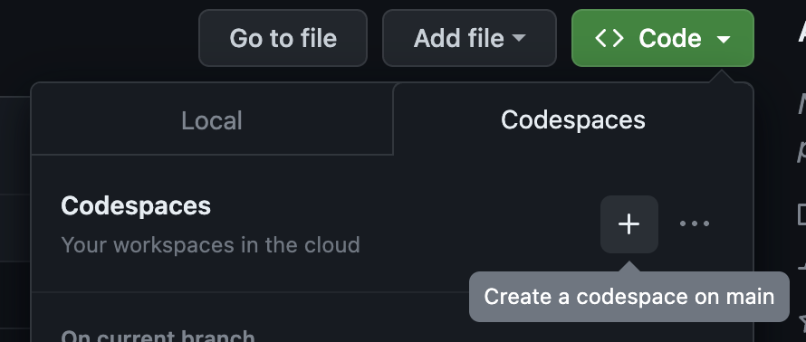
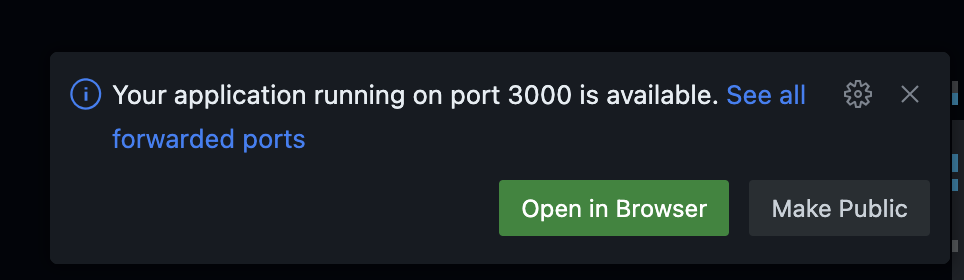

# welcome to coding with github copilot ✨

## what is this repository about?
this repository was initially created for a microsoft stu internal event to show our colleagues how easy it is to code with gh copilot, how it feels to develop with an autocomplete on steriods and teach them how to inspire customers to use gh copilot. it's current iteration will be used for a microsoft internal learning event.

## table of contents

1. [pre-requisites](#pre-requisites)
2. [tasks](#tasks)
    1. [warm-up: playing around with html, css and javascript](#-warm-up-playing-around-with-html-css-and-javascript)
    2. [main tasks](#main-tasks)
        1. [i: input, validation and event handling](#i-input-validation-and-event-handling)
        2. [ii: write your own scissors, paper, stone game](#scissors-ii-write-your-own-scissors-paper-stone-game)
        3. [iii: translate your javascript code to python](#iii-translate-your-javascript-code-to-python)
    3. [advanced copilot features](#-advanced-copilot-features)
        1. [i: github copilot extensions](#i-github-copilot-extensions)
        2. [ii: github copilot edits](#ii-github-copilot-edits)
        3. [iii: github copilot agent mode](#iii-github-copilot-agent-mode)
    4. [alternative main tasks (less coding intensive)](#-alternative-main-task-less-coding-intensive)
    5. [bonus task (only locally!!): deployment](#trophy-bonus-task-only-locally-deployment)
3. [how to setup your own github copilot demo](#how-to-setup-your-own-github-copilot-demo)

## ▶️ pre-requisites
1. create a [github account](https://github.com/signup)  
2. get access to github copilot
    1. microsofties can request access to gh copilot [here](https://repos.opensource.microsoft.com/orgs/MicrosoftCopilot)
    2. everyone else can buy a licence [here](https://copilot.github.com/) (it's free for students + teachers!)
3. setup
    1. option 1: gh codespaces
        1. in this github repository click on code & create codespace on main 
        2. open terminal
            1. `cd app`
            2. `npm install`
            3. `npm start` 
            4. click open in browser 
            5. be happy :)
    2. option 2: local 
        1. install the needed extensions for your ide
            1. [vscode](https://marketplace.visualstudio.com/items?itemName=GitHub.copilot)
            2. [visual studio](https://marketplace.visualstudio.com/items?itemName=GitHub.copilotvs)
            3. [jetbrains ides](https://plugins.jetbrains.com/plugin/17718-github-copilot)
            4. make sure you also install [GitHub Copilot Chat](https://marketplace.visualstudio.com/items?itemName=GitHub.copilot-chat) for extensions, edits and agent mode features
        2. install everything needed on your local pc (but not today - we use github codespaces!)
    3. have fun coding with github copilot! 🎉

## tasks

### 🔥 warm-up: playing around with html, css and javascript
1. open the `app/views/index.ejs` file
1. change the background color to a css gradient of your choice
2. add a button to the page
3. add a div that displays a number
4. add an on-click event to the button that increases the number by 1

> tip: if you do not know how to do something, just ask github copilot chat for help :) 

### main tasks: 

#### 🧑‍💻 i: input, validation and event handling

1. add an input field for an email address and a "Submit" button to the page
    1. bonus points: center it vertically, add a label and a placeholder
2. add an on-click event to the button that validates the email address
    1. if the email address is valid, display a success message, if the email address is invalid, display an error message
    > tip: use a regular expression to validate the email address

#### ✂️ ii: write your own scissors, paper, stone game
1. add three buttons to the page
    1. one for scissors, one for paper, one for stone
2. add an on-click event to every button to start a new game
    1. the computer should randomly choose one of the three options
    2. the user should be able to see the computers chouce, the result of the game and the score
    > tip: use a random number generator to let the computer choose one of the three options
3. write tests for your game with all possible outcomes (scissors vs scissors, scissors vs paper, scissors vs stone, paper vs scissors, paper vs paper, paper vs stone, stone vs scissors, stone vs paper, stone vs stone)

#### 🐍 iii: translate your javascript code to python
1. create a new file in the folder `app` called `game.py`
 > if your codespace asks you if you want to install the python extension, click yes
2. use github copilot to translate your javascript code to python
3. run your python code in the terminal and play the 

### 🚀 advanced copilot features

#### 🧩 i: github copilot extensions
GitHub Copilot Extensions helps you solve coding tasks by connecting to external services and utilizing specialized knowledge.

1. Access GitHub Copilot Extensions
   1. Open the Copilot Chat panel in VS Code
   2. Type `/` to see available commands including extensions
   
2. Try these extension tasks:
   1. Generate documentation for your code
      - Select a function from `app/utils.py`
      - In the chat, type `/doc` to generate documentation for the selected function
   
   2. Use `/analyze` to review your code
      - Select some code from any file
      - In the chat, type `/analyze` to get insights about potential improvements
   
   3. Generate unit tests with `/tests`
      - Select a function that needs testing
      - Type `/tests` to generate appropriate unit tests

#### ✏️ ii: github copilot edits
GitHub Copilot Edits allows you to describe changes you want to make to your code and have Copilot implement them automatically.

1. Try Copilot Edits:
   1. Open `app/views/index.ejs`
   2. Select the entire file or a section you want to modify
   3. Press `Ctrl+I` (or `Cmd+I` on Mac) to open the inline chat
   4. Type a prompt like "Add a footer with copyright information"
   5. Review the suggested edits and accept them

2. More Copilot Edits tasks:
   1. Refactor code: Select a section of code and use Copilot Edits to improve its readability
   2. Add error handling: Use Copilot Edits to add try/catch blocks around existing code
   3. Convert styles: Ask Copilot to convert inline CSS to a separate CSS class

#### 🤖 iii: github copilot agent mode
GitHub Copilot Agent mode lets Copilot take the driver's seat to help you accomplish complex tasks with minimal guidance.

1. Experience Agent mode:
   1. Open the Copilot Chat panel
   2. Type `/agent` to activate agent mode
   3. Describe a complex task like "Create a simple weather dashboard that fetches data from an API"
   4. Follow the agent's guidance and provide feedback when prompted

2. Agent mode tasks:
   1. Let the agent help you debug an issue in your code
   2. Ask the agent to implement a new feature from scratch
   3. Have the agent refactor a complex piece of code

3. Tips for effective agent mode use:
   1. Be specific about your requirements
   2. Provide feedback to guide the agent
   3. Review the agent's work carefully
   4. Break complex tasks into smaller steps

### 📝 alternative main tasks (less coding intensive)
1. open the `app/utils.py` file
2. let github copilot chat explain you the code
3. add meaningful comments to the code (rule of thumb for good comments: if you open the file in roundabout 6 months again, they should help you understand the code asap again :))
4. distribute the regular expressions to different functions
5. oh no! there is a bug 🐞 in the code. try to find out where and fix it!
6. bonus ✨: write tests for the functions

### 🏆 bonus task (only locally!!): deployment
1. open the az-deploy.sh and create an azure deployment for your app with azure cli
    1. use environment variables for the resource group name, app service plan name, app service name and location
    1. create azure app service
    2. create a linux app service plan
    3. use node 18
    4. deploy your app

## ✏️ 🎉 how to setup your own github copilot demo    
want to do your own github copilot demo? here are some tips:
1. think about a simple but fitting use case (ask about the used programming languages in advance!)
2. do a dry run and write down the steps you want to show
3. do not get nervous if there are hallucinations, be precise in your prompting
4. be aware if you are using codespaces or your local machine (the behaviour and possibilties might be different)
5. things I usually show:
    1. inline generation of a function
    2. generate deployment script
    3. generate whole html page
    4. let github copilot chat explain a piece of code
    5. let github copilot chat write a test (and explain it)
    6. using extensions like `/doc` to generate documentation
    7. using copilot edits to refactor code or add new features
    8. demonstrate agent mode for solving complex tasks
6. advanced demo tips:
    1. prepare a "broken" piece of code and use agent mode to fix it
    2. showcase how copilot can help with unfamiliar languages or frameworks
    3. demonstrate how copilot can assist with learning new APIs
    4. show how to use copilot for pair programming scenarios